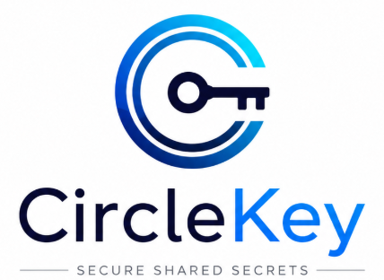

<p align="center">
  
</p>

# CircleKey

**Reference implementation of [The GroupVault Protocol](https://github.com/groupvault/protocol).**

CircleKey is a TypeScript library providing end-to-end encrypted group
data storage for small, dynamic teams — with a backend that never sees
plaintext, private keys, or group secrets. It is developed and maintained
by **Smart Horizon Consulting**.

If you're evaluating whether GroupVault fits your use case, start with
the [protocol specification](https://github.com/groupvault/protocol) — it defines the security
guarantees independently of any particular implementation. This README
covers CircleKey specifically: installation, usage, and internal
architecture.

---

## Project status

**CircleKey conforms to GroupVault Protocol v1** (spec §14) for the
client role it implements: every client-observable MUST and MUST NOT in
spec §5–§13 is satisfied and held by a named, mutation-verified test.
The full requirement-by-requirement audit is published as
[docs/conformance.md](./docs/conformance.md). The requirements CircleKey
does not hold itself are backend obligations — the host's server, not
this library — enumerated in the same document and in
[docs/backend-checklist.md](./docs/backend-checklist.md).

Conformance means the implementation matches the specification. It is
not a claim that either is free of flaws, and it is not a substitute
for independent security review. **CircleKey has not yet been
independently audited by a third party** — the analysis behind the
claim above is our own, which is precisely the limitation external
review exists to close.

**Make your own assessment before production use.** We would encourage
any team to weigh the residual risk against what they intend to protect,
rather than take our word for it. Two things make that practical: the
[threat model](https://github.com/groupvault/protocol/blob/main/README.md#13-threat-model) states plainly what the
protocol does and does not defend against, and
[docs/conformance.md](./docs/conformance.md) shows which specific test
holds each guarantee, so a reviewer can check our work rather than
trust it. We will publish the independent audit in full — findings
included — when it happens.

**Versioning.** `1.0.0` means the public API is stable, and is a
separate claim from the audit status above. The library version tracks
the *API*: a major bump means the TypeScript surface changed, not that
the protocol did. Which protocol versions a build speaks is answered by
`SUPPORTED_SUITES` — currently `["gv1"]`, GroupVault Protocol v1 — and
that list grows when a new suite is added, because spec §6.3 requires a
new suite to arrive alongside existing data rather than replacing it.

**Where the implementation stands.** All of GroupVault Protocol v1 is
implemented and tested: the epoch chain and full §9.1 verification
checklist, small-group governance with `min_managers` enforcement,
multi-device linking and revocation, mandatory Argon2id-backed recovery,
live sync with concurrent-manager conflict recovery, and multi-tab/
offline hardening.

**Metadata minimization** (spec §5.8): the backend never learns *who* is in a group, how many, or
what a governance change did. Group composition, governance history, the
action type and the policy travel inside a sealed, padded transition
body; envelopes are unaddressed and decoy-filled; identifiers are random
or derived; relay requests are authenticated per epoch. A relay can tell
neither an add from a removal, nor how many members a group has, nor
whether a given person is one.

---

## Why CircleKey?

**For teams that cannot assume their server is trustworthy.** Most
products described as encrypted still keep a key on the server, which
leaves the data one breach, one rogue administrator, or one court order
away from being readable. CircleKey takes the server out of the trust
equation: keys are created on the device and never leave it, and the
backend holds ciphertext it has no means to open.

That matters most where disclosure costs something other than money —
human rights defenders and the organisations that support them,
journalists protecting sources, clinical and legal teams, investigations
that must stay inside a small panel, security operations whose own
infrastructure may be the thing under attack. It matters just as much
for ordinary teams who have simply decided their hosting provider should
not be part of their threat surface.

The asymmetry is the argument. A server is a concentrated target:
reachable from anywhere, administered by people your team never meets,
copied into backups and logs, and subject to legal compulsion. The
clients are fragmented, and they are held by the people entitled to read
the data anyway. Moving the trust boundary onto the device does not
abolish risk — it relocates it to the smaller, better-understood
surface, and removes the single point whose compromise exposes everyone
at once.

CircleKey defends against a compromised,
curious, or compelled **backend**. It does not defend a device that is
already compromised. Other measures should be taken to protect the clients' devices — see
[what the protocol does and does not defend against](https://github.com/groupvault/protocol/blob/main/README.md#13-threat-model).

- **Zero trust in the server, by construction** — the backend is a relay
  that stores opaque blobs. Not "we promise not to look": it holds no
  key that could open them
- **Zero-knowledge backend** — the server only ever stores ciphertext and
  non-secret bookkeeping ([spec §5.1](https://github.com/groupvault/protocol/blob/main/README.md#51-zero-knowledge-backend))
- **Metadata minimization** — the backend also never learns *who* is in a
  group, how many, or what a governance change did: membership, action
  and policy travel inside a sealed, fixed-size body, and every
  structure is padded so its length says nothing
  ([spec §5.8](https://github.com/groupvault/protocol/blob/main/README.md#58-metadata-minimization))
- **Small-group governance** — manager roles, configurable multi-manager
  policies, and an auditable, signature-chained membership history
  ([spec §8](https://github.com/groupvault/protocol/blob/main/README.md#8-group-governance-model))
- **Immediate revocation** — removing a member rotates the group secret
  and takes effect immediately for new data; clients sync before
  encrypting so a stale epoch is never used, without relying on the
  backend to catch it ([spec §9.3](https://github.com/groupvault/protocol/blob/main/README.md#93-remove-member-immediate))
- **Multi-device by default** — link additional devices per user, with
  mandatory, non-skippable backup so no one gets permanently locked out
  ([spec §9.5–9.6](https://github.com/groupvault/protocol/blob/main/README.md#95-multi-device))
- **Full workspace history** — new members inherit the group's existing
  work, matching how shared-workspace tools are expected to behave
  ([spec §9.7](https://github.com/groupvault/protocol/blob/main/README.md#97-new-member-access-to-group-history))

## Installation

```bash
npm install circlekey
```

> Implements GroupVault Protocol v1 (suite `gv1`). The API follows
> semver from `1.0.0` on.

## Quick start

```typescript
import { GroupVault } from "circlekey";

// `transport` is your backend adapter (spec §10) — see
// docs/backend-checklist.md; MockTransport from `circlekey/testing`
// is the executable reference to develop against.
const vault = await GroupVault.open({ transport, userId: "alice" });

// Backup enrollment is mandatory before any group operation
// (spec §9.6), and it is two-phase on purpose: group operations stay
// blocked until the user confirms they saved the credential, so a
// device can never end up "enrolled" with a backup nobody can open.
const recoveryCredential = await vault.enrollBackup(); // show this once
await vault.confirmBackupStored(recoveryCredential);   // after the user saves it

// Create a group — the creator becomes its first manager. The id is
// generated here, not chosen: it is plaintext on every request, so the
// protocol requires an opaque one (spec §6.5). Keep your own label
// against it.
const { group_id: groupId } = await vault.createGroup({ min_managers: 1 });

// Add a member once their device public key is known (out of band).
await vault.addMember(groupId, { userId: "bob", devicePubkey });

// Encrypt + store, fetch + decrypt. Keep addressing records by a name
// that means something to you: what reaches the relay is an opaque
// identifier derived from it (spec §5.8), never "q3-layoff-plan".
await vault.putJsonRecord(groupId, "doc-1", { title: "Q3 report" });
const doc = await vault.getJsonRecord(groupId, "doc-1");

// `listRecords` therefore returns derived ids. Map them back by
// deriving your own — the relay cannot.
const mine = await vault.recordIdFor(groupId, "doc-1");

// Lost device? Restore identity and full access from the credential.
const recovered = await GroupVault.restore({
  transport, userId: "alice", credential: recoveryCredential,
});
```

> **Interactive tutorials** run this library in your browser — create a
> vault, admit a member, watch an outsider be refused, revoke access,
> and recover a destroyed device — at
> **[circlekey.io](https://circlekey.io)**.

> **Records are for documents and credentials, not large binaries.**
> `putRecordBytes` pads, encrypts and base64-encodes its input as one
> in-memory operation — there is no streaming or chunking yet (v2
> roadmap). Practical size stays in the low single-digit megabytes;
> put a large file in general-purpose blob storage and keep only its
> key (small) inside a CircleKey record.

## The backend

CircleKey is a client library, so something still has to store the
ciphertext and keep each group's transition history in order. That is a
small service, but a real one to operate — and it is deliberately the
one piece this repository does not contain.

Two ways to get one:

- **Run your own.** The contract is fully specified in
  [docs/backend-checklist.md](./docs/backend-checklist.md);
  `MockTransport` from `circlekey/testing` is an executable reference
  implementation of it, and `runHostIntegrationScenario` is an
  acceptance test you can point at your own server to prove it conforms.
- **Use [CircleKey Cloud](https://circlekey.io).** A hosted
  zero-knowledge relay built against exactly this contract: you write
  the application, we hold ciphertext we cannot read. Pricing, the
  security model, and a field-by-field account of what our servers can
  and cannot see are at **[circlekey.io](https://circlekey.io)**.

Both doors are open deliberately. A backend you are free to leave is the
only kind worth trusting — and the same acceptance test proves either
one conforms.

## Architecture

CircleKey organizes its implementation of the GroupVault Protocol into
the following modules:

| Module | Responsibility |
|---|---|
| `GroupVault` | The facade the host application uses: groups, records, backup, events |
| `KeyManager` | Per-device identity keypairs (X25519 + Ed25519), backup key wrapping |
| `GroupManager` | Group state, manager set, policy, invariant enforcement |
| `EpochChain` | Transition format, signature chain, client-side verification of the full §9.1 checklist |
| `Wire` | The outer `WireTransition` the relay sees: body sealing, decoy envelope placement, removal notices (spec §6.5) |
| `Profiles` / `Padding` | Capacity profiles, and the fixed sizes every sealed structure is padded to (spec §5.8) |
| `Handles` | The opaque identifiers that reach the relay — generated `group_id`, derived `record_id`, blinded backup handle |
| `RelayAuth` | Per-epoch request signing keys and the §10.1 read/write split |
| `DeviceManager` | Device linking and revocation, via the self-scoped `add_device` / `remove_device` actions (spec §9.5) |
| `RecordCrypto` | Per-record key derivation, AES-GCM encrypt/decrypt, nonce/usage tracking |
| `KDF` | HKDF-SHA256 wrapper with enforced domain-separation labels |
| `BackupManager` | Mandatory Argon2id/PBKDF2 backup blob creation and recovery |
| `IndexedDbStore` | Local persistence: identity, verified history, cached secrets, atomic usage counters, offline record cache |
| `SyncManager` | The client side of the backend contract — polling, live subscriptions, conflict rebuild-and-retry (spec §10) |

This module breakdown is specific to CircleKey — it is **not** required
by the protocol itself, and other implementations (in other languages or
platforms) are free to organize their code differently.

## Relationship to the GroupVault Protocol

CircleKey implements [The GroupVault Protocol](https://github.com/groupvault/protocol) — an open
specification for end-to-end encrypted group data with signed, auditable
membership changes. The protocol and this implementation are kept as
separate documents intentionally:

- The **protocol** defines the security guarantees and client/backend
  contract, independent of language or platform.
- **CircleKey** is one implementation of it, written in TypeScript for
  browser-first use.

This separation is meant to allow other implementations (Rust, Go,
Python, etc.) to exist and interoperate against the same protocol,
verified against the same [conformance criteria](https://github.com/groupvault/protocol/blob/main/README.md#14-conformance),
without being tied to CircleKey's specific code.

## Roadmap

CircleKey's implementation roadmap is distinct from the GroupVault
Protocol's own roadmap — see [spec §15](https://github.com/groupvault/protocol/blob/main/README.md#sec-15)
for planned protocol-level changes.

### v1 — shipped
- Browser support, IndexedDB-backed storage
- Full GroupVault Protocol v1 conformance: epoch chain, governance model,
  multi-device linking, mandatory backup, backend freshness gate
- Metadata minimization: sealed transition bodies, unaddressed envelopes,
  padded structures, opaque identifiers, per-epoch relay authentication

### v2
- Web Workers for crypto operations off the main thread
- Batch and streaming encryption APIs
- Multi-device synchronization refinements

### v3
- WebAuthn / Passkeys for device key custody
- Hardware-backed keys (TPM / Secure Enclave integration, where available)

### v4
- Support for optional protocol extensions as they are defined (TreeKEM
  backend, threshold-based manager recovery, PQ-hybrid suite)

## Development

CircleKey is a plain TypeScript library (ESM, `strict` mode). To work
on the source you need **Node.js ≥ 20** and npm:

```bash
git clone https://github.com/smarthorizon-labs/circlekey.git
cd circlekey
npm install
```

| Command | What it does |
|---|---|
| `npm test` | Run the test suite once (vitest) |
| `npm run test:watch` | Run tests in watch mode |
| `npm run typecheck` | Strict type checking (`tsc --noEmit`) |
| `npm run lint` | ESLint over the whole repo |
| `npm run build` | Build ESM output + type declarations into `dist/` (tsup) |

The test suite runs fully offline against in-memory adapters — no real
backend or network is ever needed. CI (`.github/workflows/ci.yml`) runs
typecheck, lint, tests, and build on Node 20 and 22, on every push and
pull request.

Some behaviour cannot be exercised in Node at all — the Web Locks API,
`BroadcastChannel`, and real IndexedDB. Those have a **browser suite**
that is run by hand:

```bash
npm run build
npx http-server -p 4173 -c-1 .
# then open http://localhost:4173/test/browser/
```

Before contributing code, read [docs/architecture.md](./docs/architecture.md)
(layering, module structure, the non-negotiable invariants, and the
pitfalls worth knowing before you change anything).

## Security

- Threat model: see [spec §13](https://github.com/groupvault/protocol/blob/main/README.md#13-threat-model)
- To report a security vulnerability, see [SECURITY.md](./SECURITY.md)
  rather than opening a public issue.

## Contributing

CircleKey is open source and welcomes contributions.
[CONTRIBUTING.md](./CONTRIBUTING.md) has the development setup, the
testing bar, and the rules that keep this a trustworthy implementation
of a security protocol.

**Protocol issues belong in the protocol repository.** A flaw or
ambiguity in the specification affects every implementation, not just
this one, so raise it at
[github.com/groupvault/protocol](https://github.com/groupvault/protocol/issues). Issues here
are for CircleKey itself: its API, its behaviour, and its conformance to
the spec.

Security reports are the exception to "open an issue": see
[SECURITY.md](./SECURITY.md) instead.

## License

CircleKey is licensed under the
[Mozilla Public License 2.0](./LICENSE). MPL-2.0 is **file-level
copyleft**: you may use CircleKey inside a closed-source application
without that application becoming open source, but changes you make to
CircleKey's own files must be published under the same licence.
Improvements to the library come back; what you build on top of it stays
yours.

The GroupVault Protocol specification is maintained and licensed
separately, in [its own repository](https://github.com/groupvault/protocol) — the usual split
between a specification and one implementation of it, and a signal that
GroupVault is meant to be implemented freely rather than only by us.

## About

CircleKey is developed and maintained by **Smart Horizon Consulting**
as its first open-source initiative. Visit **[circlekey.io](https://circlekey.io)** for
more information.

CircleKey's code was expanded, tested, revised, and documented with the
help of AI, using Claude Fable 5 and Claude Opus 5. We invite
contributors to keep working with AI models here: held to the testing
bar in [CONTRIBUTING.md](./CONTRIBUTING.md) — rejection-path tests,
property tests, and the habit of breaking a test to prove it can fail —
they have raised the quality and security of this codebase rather than
diluting it.

